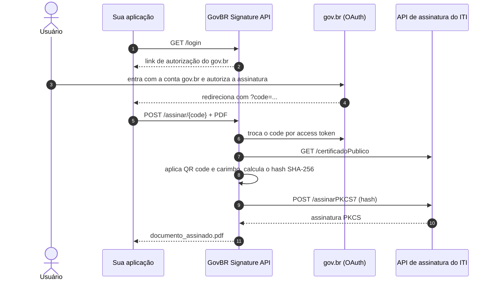

<div align="center">


# GovBR Signature Integration

**API em Java que assina PDFs com a assinatura eletrônica do gov.br, direto pela API do ITI.**

[](https://openjdk.org/)
[](https://spring.io/projects/spring-boot)
[](https://itextpdf.com/)
[](https://manual-integracao-assinatura-eletronica.servicos.gov.br/)
[](#com-docker)
[](LICENCE)

[Como funciona](#como-funciona) · [Como rodar](#como-rodar) · [Endpoints](#endpoints) · [Configuração](#configuração) · [Créditos](#créditos)

</div>

## Sobre

O gov.br oferece assinatura eletrônica gratuita para quem tem conta prata ou ouro. Esta API faz a ponte entre a sua aplicação e o serviço de assinatura do ITI: recebe um PDF, usa a autorização que o usuário deu no gov.br, assina o hash do documento e devolve o PDF assinado.

- Assinatura de um PDF por vez ou de vários em lote, com uma única autorização.
- Assinatura PKCS#7 embutida no PDF com iText. Em produção, o resultado pode ser conferido no [validar.iti.gov.br](https://validar.iti.gov.br/).
- Carimbo visível com logotipo, nome do signatário (lido do certificado), instituição e data.
- QR code aplicado à primeira página.
- Configuração por arquivo `.env`, com exemplo pronto para a homologação do ITI.

## Como funciona



O `code` do gov.br vale para uma única troca por token. Para assinar vários arquivos com uma autorização, use o escopo `signature_session` e a rota de lote.

## Como rodar

Pré-requisitos: JDK 17 e Maven (ou o `mvnw` do projeto).

```bash
git clone https://github.com/ronnyarruda20/govbr-signature-integration.git
cd govbr-signature-integration
cp .env.exemple .env        # já aponta para a homologação do ITI
./mvnw spring-boot:run
```

Depois:

1. Abra <http://localhost:8080/login> e clique em um dos links. O primeiro autoriza um arquivo, o segundo autoriza um lote.
2. Entre no gov.br. Na homologação, use uma conta de teste do ITI.
3. Copie o parâmetro `code` da URL para onde o gov.br redirecionou.
4. Envie o PDF:

```bash
curl -X POST "http://localhost:8080/assinar/<code>" \
  -F "pdf=@certificado.pdf" \
  -o certificado_assinado.pdf
```

A documentação interativa da API fica em <http://localhost:8080/swagger-ui.html>.

### Com Docker

```bash
cp .env.exemple .env
docker compose up --build
```

A imagem compila o projeto com JDK 17 e roda só com o JRE. As variáveis vêm do `.env`.

## Endpoints

| Método | Rota | Entrada | Saída |
|---|---|---|---|
| `GET` | `/login` | `code` opcional | Sem `code`: links de autorização do gov.br. Com `code`: devolve o próprio code |
| `POST` | `/assinar/{code}` | `multipart/form-data`, campo `pdf` | `application/pdf` com o nome `<arquivo>_assinado.pdf` |
| `POST` | `/assinar/lote/{code}` | `multipart/form-data`, campo `pdfs` repetido | `multipart/mixed`, uma parte por PDF assinado |

Erros: `400` para arquivo ausente ou vazio, `415` para arquivo que não é PDF e `500` para falha na comunicação com o gov.br ou o ITI.

## Configuração

As variáveis ficam no `.env` na raiz do projeto, que o Spring lê ao iniciar.

| Variável | Uso |
|---|---|
| `SERVIDOR_OAUTH` | Servidor OAuth do gov.br (`cas.staging.iti.br/oauth2.0` na homologação) |
| `CLIENT_ID` | Identificador da aplicação cadastrada no gov.br |
| `SECRET` | Segredo da aplicação |
| `REDIRECT_URI` | URL para onde o gov.br devolve o `code`; precisa ser igual à do cadastro |
| `ASSINATURA_API_URI` | Base da API de assinatura do ITI |
| `SERVER_PORT` | Porta da aplicação |
| `IMG_QR_CODE_SOURCE` | QR code (SVG) aplicado ao documento |
| `IMG_ESP_LOGO` | Logotipo exibido no carimbo |
| `IMG_RUBRIC_SOURCE` | Imagem de rubrica (declarada na configuração, ainda sem uso no código) |
| `SECURITY_USER_NAME` / `SECURITY_USER_PASSWORD` | Usuário das rotas protegidas (padrão `admin` / `admin123`) |

As credenciais do `.env.exemple` são as de teste do ambiente de homologação do ITI. Em produção é preciso cadastrar a aplicação no gov.br e trocar `SERVIDOR_OAUTH` e `ASSINATURA_API_URI` pelos endereços de produção. O processo está no [manual de integração](https://manual-integracao-assinatura-eletronica.servicos.gov.br/).

### Personalizar o carimbo

O projeto nasceu para assinar certificados, então as posições do QR code e do carimbo são calculadas para A4 em paisagem, na primeira página. Isso fica em `SignatureManager`. O texto do carimbo fica em `Util.getPdfSignatureAppearanceContent` e traz o nome da Escola de Saúde Pública do Ceará, instituição do projeto original. Para usar em outro contexto, ajuste esses dois pontos e troque as imagens de `assets/`.

## Estrutura

```
src/main/java/com/esp/govbrsignatureintegration/
├── controllers/   /login e /assinar
├── services/      chamadas ao gov.br (token) e ao ITI (certificado, assinatura)
├── signature/     montagem do PDF assinado com iText
├── configs/       segurança, CORS e WebClients
├── exceptions/    erros de integração e handler global
└── utils/         hash SHA-256, URL de autorização e texto do carimbo
assets/            logotipos, rubrica e QR codes
```

## Créditos

Projeto criado pelo [FeliciLab](https://github.com/FeliciLab/govbr-signature-integration), da Escola de Saúde Pública do Ceará, com código principal de Ericson Moreira e contribuições de Lucas Queiroz. Esta versão migra o projeto para Spring Boot 3.4 e Java 17, atualiza a documentação OpenAPI e refaz a imagem Docker.

Distribuído sob a licença [AGPL-3.0](LICENCE). Quem oferecer uma versão modificada como serviço de rede precisa disponibilizar o código-fonte aos usuários.

---

<div align="center">
<sub>Mantido por <a href="https://github.com/ronnyarruda20">Ronny Arruda</a> · <a href="https://ronnyarruda20.github.io">ronnyarruda20.github.io</a></sub>
</div>
